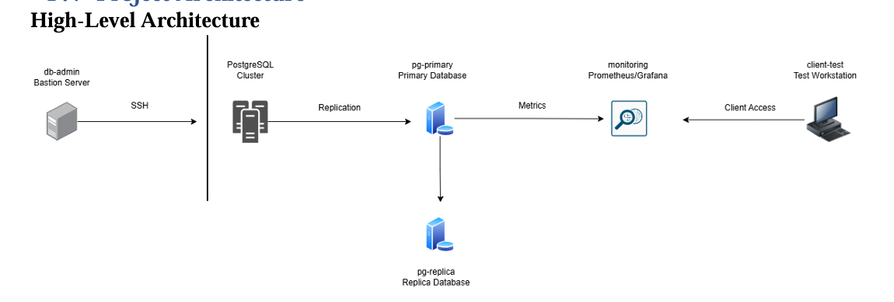

# Enterprise PostgreSQL Administration Lab

## Overview

Enterprise PostgreSQL infrastructure deployed in a VMware Workstation virtualized environment.

Features include:

- PostgreSQL Administration
- Linux Administration
- Security Hardening
- Backup & Recovery
- Streaming Replication
- High Availability
- Monitoring & Observability
- Automation
- Incident Management

---

## Technologies

- Ubuntu Server
- PostgreSQL
- Prometheus
- Grafana
- Node Exporter
- PostgreSQL Exporter
- Bash
- Ansible
- VMware Workstation

---

## Infrastructure

| Server     | Role                       |
|------------|----------------------------|
| pg-primary | Primary Database           |
| pg-replica | Standby Database           |
| monitoring | Monitoring Platform        |
| db-admin   | Administration Workstation |

---

## Architecture



---

## Project Objectives

Design and deploy a secure, resilient, monitored, and manageable PostgreSQL infrastructure on Linux servers within a VMware Workstation environment.

🖥️ Infrastructure Administration
- Deploy multiple Linux servers
- Configure static IP addressing
- Manage system services
- Enable remote administration

🗄️ Database Administration
- Install PostgreSQL
- Create and manage databases
- Define users and roles
- Configure authentication
- Manage schemas and privileges

🔐 Security
- Harden Linux servers
- Secure database access
- Restrict network exposure
- Implement auditing and logging

💾 Data Protection
- Configure backups
- Implement recovery procedures
- Validate restoration processes

⚡ High Availability
- Deploy PostgreSQL replication
- Test synchronization
- Simulate failover scenarios

📊 Monitoring
- Monitor infrastructure health
- Track database performance
- Collect metrics
- Visualize dashboards

🛠️ Operations
- Troubleshoot incidents
- Analyze logs

---

## Key Skills Demonstrated

- PostgreSQL Administration
- Linux Systems Administration
- Security Hardening
- Disaster Recovery
- High Availability
- Monitoring
- Infrastructure Automation

---

## Repository Structure

```bash
enterprise-postgresql-administration-lab/
├── ansible
│   ├── inventory.ini
│   └── playbooks
│       └── update_servers.yml
├── docs
│   ├── 01-project-overview
│   │   └── Project_Overview.pdf
│   ├── 02-architecture
│   │   ├── Architecture.pdf
│   │   ├── Automation_Architecture.png
│   │   ├── Backup_Architecture.png
│   │   ├── Monitoring_Architecture.png
│   │   ├── PostgreSQL_Replication_Architecture.png
│   │   └── Project_Architecture.png
│   ├── 03-installation
│   │   └── Installation.pdf
│   ├── 04-security
│   │   └── Security.pdf
│   ├── 05-backup-recovery
│   │   └── Backup_Strategy.pdf
│   ├── 06-replication-ha
│   │   └── Replication.pdf
│   ├── 07-monitoring
│   │   └── Monitoring.pdf
│   ├── 08-automation
│   │   └── Automation.pdf
│   ├── 09-incident-management
│   │   └── Incident_Management.pdf
│   └── 10-project-closure
│       └── Deployment_Guide.pdf
├── LICENSE
├── monitoring
│   ├── grafana
│   └── prometheus
│       ├── prometheus.service
│       └── prometheus.yml
├── README.md
├── screenshots
│   ├── automation
│   ├── backup-recovery
│   ├── inital-configuration
│   ├── monitoring
│   ├── replication-ha
│   └── security-hardening
└── scripts
    ├── backups
    │   ├── cleanup_backups.sh
    │   └── postgres_logical_backup.sh
    ├── monitoring
    │   ├── check_all_servers.sh
    │   ├── check_backups.sh
    │   ├── check_database.sh
    │   ├── check_db_size.sh
    │   ├── check_disk_usage.sh
    │   ├── check_memory.sh
    │   ├── check_postgresql.sh
    │   ├── check_replication_lag.sh
    │   └── check_replication.sh
    └── reporting
        └── daily_report.sh
```

---

## Author

David Gottlieb SITTI
